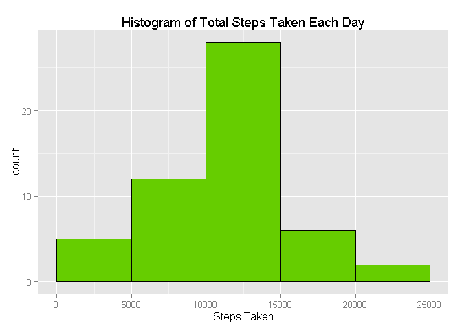
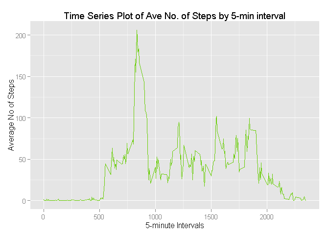
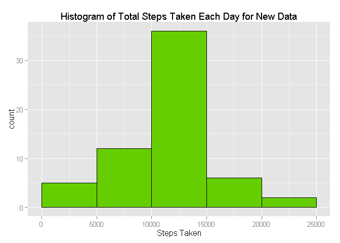
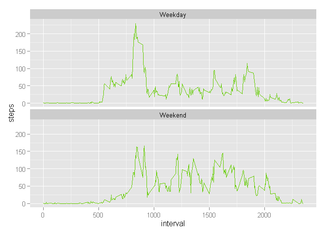

# Reproducible Research: Peer Assessment 1
***

## Introduction

This paper is a course requirement in the Reproducible Research class. It aims to answer the questions posted as part of the Peer Assessment 1. 

Data is coming from a personal activity monitoring device such as a Fitbit, Nike Fuelband, or Jawbone Up. It is collected at 5 minute intervals through out the day and consists of 2 months of data from an anonymous individual. Measurements  were gathered during the months of October and November, 2012 and include the number of steps taken in 5 minute intervals each day.

***

## Loading and preprocessing the data

To get started, the required R package(s) need to be loaded first.

```r
library(ggplot2)
```

The appropriate working R directory also needs to be set.

```r
setwd("D:/GitHub/RepData_PeerAssessment1")
```

#### 1. Load the data (i.e. read.csv())

The provided data (activity.csv) is contained in a compressed format, so it needs to be unzipped first. Then, data will be loaded into the **activityData** data frame.

```r
file <- "activity.zip"
activityData <- read.csv(unz(file, "activity.csv"), header = TRUE, sep = ",", 
    stringsAsFactors = FALSE)
```

#### 2. Process/transform the data (if necessary) into a format suitable for your analysis

A quick check on the column data types for **activityData** would show that the **date** column is not appropriately set.

```r
str(activityData)
```

```
## 'data.frame':	17568 obs. of  3 variables:
##  $ steps   : int  NA NA NA NA NA NA NA NA NA NA ...
##  $ date    : chr  "2012-10-01" "2012-10-01" "2012-10-01" "2012-10-01" ...
##  $ interval: int  0 5 10 15 20 25 30 35 40 45 ...
```

Hence, the **date** column would have to be changed into *Date* type

```r
activityData$date <- as.Date(activityData$date)
```

***

## What is mean total number of steps taken per day?

#### 1. Make a histogram of the total number of steps taken each day
First, aggregate total steps by date.

```r
totalStepsByDate <- aggregate(steps ~ date, data = activityData, sum)
```

Then, create a histogram using the aggregated data.

```r
qplot(totalStepsByDate$steps, geom = "histogram", binwidth = 5000, main = "Histogram of Total Steps Taken Each Day", 
    xlab = "Steps Taken", fill = I("chartreuse3"), col = I("black"), xlim = c(0, 
        25000))
```

 

#### 2. Calculate and report the mean and median total number of steps taken per day

```r
# Mean total number of steps taken per day
mean(totalStepsByDate$steps)
```

```
## [1] 10766.19
```


```r
# Median total number of steps taken per day
median(totalStepsByDate$steps)
```

```
## [1] 10765
```

***

## What is the average daily activity pattern?

#### 1. Make a time series plot (i.e. type = "l") of the 5-minute interval (x-axis) and the average number of steps taken, averaged across all days (y-axis)

The mean for steps taken will be aggregated first for each of the 5-minute interval.

```r
aveStepsByInterval <- aggregate(steps ~ interval, data = activityData, mean)
```

To visualize, here is a time series plot for the average steps taken by each 5-minute interval.

```r
ggplot(aveStepsByInterval, aes(interval, steps)) + geom_line(color = "chartreuse3") + 
    labs(title = "Time Series Plot of Ave No. of Steps by 5-min interval", x = "5-minute Intervals", 
        y = "Average No of Steps")
```

 

#### 2. Which 5-minute interval, on average across all the days in the dataset, contains the maximum number of steps?

Taking the first 5 Intervals that had the highest average numer of steps, **835** tops the list with a mean of 206.17 steps during this particular interval.

```r
head(aveStepsByInterval[order(-aveStepsByInterval$steps), ])
```

```
##     interval    steps
## 104      835 206.1698
## 105      840 195.9245
## 107      850 183.3962
## 106      845 179.5660
## 103      830 177.3019
## 101      820 171.1509
```

***

## Imputing missing values

There are a number of days and intervals which are missing values (coded as NA). These may introduce bias into some calculations or summaries of the data.

#### 1. Calculate and report the total number of missing values in the dataset (i.e. the total number of rows with NAs)

```r
sum(is.na(activityData$steps))
```

```
## [1] 2304
```

#### 2. Devise a strategy for filling in all of the missing values in the dataset. The strategy does not need to be sophisticated. For example, you could use the mean/median for that day, or the mean for that 5-minute interval, etc.

Since there are a couple of days wherein the entire dataset for steps are all missing, it would be best to use the other approach by substituting the missing values by the mean for each 5-minute interval.

#### 3. Create a new dataset that is equal to the original dataset but with the missing data filled in.

A new dataset will be created by copying the values from the original dataset. This would be helpful in comparing the original (NA) against the new values.

```r
newActData <- activityData
```

In the new dataset, the rounded mean steps by each 5-minute interval will replace where **steps** data is missing (NA).

```r
for (i in which(is.na(newActData$steps))) {
    newActData$steps[i] <- round(mean(newActData[which(newActData$interval == 
        newActData$interval[i]), colnames(newActData) == "steps"], na.rm = TRUE))
}
```

To verify, the first 10 rows for **date=="2012-10-01"** will be displayed. Originally, all **steps** data for this date was missing.

```r
head(newActData, 10)
```

```
##    steps       date interval
## 1      2 2012-10-01        0
## 2      0 2012-10-01        5
## 3      0 2012-10-01       10
## 4      0 2012-10-01       15
## 5      0 2012-10-01       20
## 6      2 2012-10-01       25
## 7      1 2012-10-01       30
## 8      1 2012-10-01       35
## 9      0 2012-10-01       40
## 10     1 2012-10-01       45
```

#### 4. Make a histogram of the total number of steps taken each day and Calculate and report the mean and median total number of steps taken per day. Do these values differ from the estimates from the first part of the assignment? What is the impact of imputing missing data on the estimates of the total daily number of steps?

Aggregating again the total steps by date using the new dataset and create a histogram.

```r
newTotalStepsByDate <- aggregate(steps ~ date, data = newActData, sum)
```

Below is the new histogram for the total steps taken by date.

```r
qplot(newTotalStepsByDate$steps, geom = "histogram", binwidth = 5000, main = "Histogram of Total Steps Taken Each Day for New Data", 
    xlab = "Steps Taken", fill = I("chartreuse3"), col = I("black"), xlim = c(0, 
        25000))
```

 

Calculating the mean and median of the new dataset.

```r
# Mean total number of steps taken per day
mean(newTotalStepsByDate$steps)
```

```
## [1] 10765.64
```


```r
# Median total number of steps taken per day
median(newTotalStepsByDate$steps)
```

```
## [1] 10762
```

Comparing the mean and median estimates from the first part of the assignment against the new dataset, the **estimated measures do not differ significantly**. This can be attributed to strategy used where central measures of the dataset were used to substitute the missing values. Hence, the general chracteristics of the dataset were maintained in the new dataset.

```r
# Average Number of Steps from Old Data
mean(totalStepsByDate$steps)
```

```
## [1] 10766.19
```

```r
# Average Number of Steps with New Data
mean(newTotalStepsByDate$steps)
```

```
## [1] 10765.64
```

```r
# Median Number of Steps from Old Data
median(totalStepsByDate$steps)
```

```
## [1] 10765
```

```r
# Median Number of Steps with New Data
median(newTotalStepsByDate$steps)
```

```
## [1] 10762
```

***

## Are there differences in activity patterns between weekdays and weekends?

#### 1. Create a new factor variable in the dataset with two levels - "weekday" and "weekend" indicating whether a given date is a weekday or weekend day.

```r
for (i in 1:nrow(newActData)) {
    newActData$day[i] <- if (weekdays(newActData$date[i]) == "Saturday" || weekdays(newActData$date[i]) == 
        "Sunday") 
        "Weekend" else "Weekday"
}
```

Checking if the new factor variable is correct and makes sense.

```r
aggregate(day ~ date + weekdays(date), data = newActData, max)
```

```
##          date weekdays(date)     day
## 1  2012-10-05         Friday Weekday
## 2  2012-10-12         Friday Weekday
## 3  2012-10-19         Friday Weekday
## 4  2012-10-26         Friday Weekday
## 5  2012-11-02         Friday Weekday
## 6  2012-11-09         Friday Weekday
## 7  2012-11-16         Friday Weekday
## 8  2012-11-23         Friday Weekday
## 9  2012-11-30         Friday Weekday
## 10 2012-10-01         Monday Weekday
## 11 2012-10-08         Monday Weekday
## 12 2012-10-15         Monday Weekday
## 13 2012-10-22         Monday Weekday
## 14 2012-10-29         Monday Weekday
## 15 2012-11-05         Monday Weekday
## 16 2012-11-12         Monday Weekday
## 17 2012-11-19         Monday Weekday
## 18 2012-11-26         Monday Weekday
## 19 2012-10-06       Saturday Weekend
## 20 2012-10-13       Saturday Weekend
## 21 2012-10-20       Saturday Weekend
## 22 2012-10-27       Saturday Weekend
## 23 2012-11-03       Saturday Weekend
## 24 2012-11-10       Saturday Weekend
## 25 2012-11-17       Saturday Weekend
## 26 2012-11-24       Saturday Weekend
## 27 2012-10-07         Sunday Weekend
## 28 2012-10-14         Sunday Weekend
## 29 2012-10-21         Sunday Weekend
## 30 2012-10-28         Sunday Weekend
## 31 2012-11-04         Sunday Weekend
## 32 2012-11-11         Sunday Weekend
## 33 2012-11-18         Sunday Weekend
## 34 2012-11-25         Sunday Weekend
## 35 2012-10-04       Thursday Weekday
## 36 2012-10-11       Thursday Weekday
## 37 2012-10-18       Thursday Weekday
## 38 2012-10-25       Thursday Weekday
## 39 2012-11-01       Thursday Weekday
## 40 2012-11-08       Thursday Weekday
## 41 2012-11-15       Thursday Weekday
## 42 2012-11-22       Thursday Weekday
## 43 2012-11-29       Thursday Weekday
## 44 2012-10-02        Tuesday Weekday
## 45 2012-10-09        Tuesday Weekday
## 46 2012-10-16        Tuesday Weekday
## 47 2012-10-23        Tuesday Weekday
## 48 2012-10-30        Tuesday Weekday
## 49 2012-11-06        Tuesday Weekday
## 50 2012-11-13        Tuesday Weekday
## 51 2012-11-20        Tuesday Weekday
## 52 2012-11-27        Tuesday Weekday
## 53 2012-10-03      Wednesday Weekday
## 54 2012-10-10      Wednesday Weekday
## 55 2012-10-17      Wednesday Weekday
## 56 2012-10-24      Wednesday Weekday
## 57 2012-10-31      Wednesday Weekday
## 58 2012-11-07      Wednesday Weekday
## 59 2012-11-14      Wednesday Weekday
## 60 2012-11-21      Wednesday Weekday
## 61 2012-11-28      Wednesday Weekday
```

#### 2. Make a panel plot containing a time series plot (i.e. type = "l") of the 5-minute interval (x-axis) and the average number of steps taken, averaged across all weekday days or weekend days (y-axis).

Aggregate the average steps taken by 5-min interval on "weekday" or "weekend".

```r
meanStepsbyDayInterval <- aggregate(steps ~ day + interval, newActData, mean)
```

Here is the resulting panel plot for average steps by Day and Interval

```r
ggplot(meanStepsbyDayInterval, aes(interval, steps)) + geom_line(color = "chartreuse3") + 
    facet_wrap(~day, ncol = 1)
```

 
